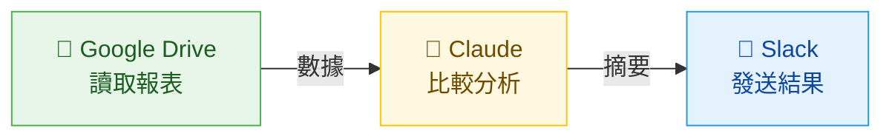

# AI 工具概覽

快速搞懂名詞，建立正確期待

<div class="abs-br m-6 text-sm opacity-50">
KKday 全球策略行銷處工作坊 — 2026/03/25
</div>

<!--
「在我們開始動手之前，先花幾分鐘把一些名詞搞清楚。
這些詞你們可能在新聞或同事聊天中聯過，今天一次幫大家對齊。」
-->

---

# 今天的流程

<div class="mt-2 text-base">

| | 主題 | 內容 |
|---|------|------|
| 1 | **AI 工具概覽** | 搞懂名詞、建立正確期待 |
| 2 | **AI 能與不能** | 知道邊界，避免踩雷 |
| 3 | **Claude Desktop 介紹** | Chat / Cowork / Connectors / Skills |
| 4 | **Claude vs Gemini** | 依場景選對工具 |
| 5 | **動手試試看** | 上傳檔案 Review 練習 |
| 6 | **Mixpanel × AI 實作** | 用 Cowork 直接查數據、產報表 |

</div>

<!--
「先讓大家看一下今天的流程。
前半段會快速對齊名詞跟觀念，後半段全部是動手實作。」
-->

---

# AI 到底是什麼？

<div class="grid grid-cols-2 gap-12 mt-4">
<div>

### 你可以想成...

<div class="text-xl mt-4 leading-relaxed">
一個讀過<span class="text-blue-600 font-bold">整個圖書館所有書</span>的超級助手<br>
你傳紙條問它，它寫紙條回你
</div>

<div class="mt-6 text-sm opacity-70">

- 正式名稱：**LLM**（Large Language Model，大型語言模型）
- 它的原理：像小朋友學說話——聽了超多句子，學會「接下來最可能講什麼」
- 不是搜尋引擎——它是用自己讀過的東西「寫出」答案，不是去 Google「查」答案

</div>

</div>
<div>

### 你不需要知道的

<div class="mt-4 text-base opacity-60">

- 神經網路怎麼運作
- 模型怎麼訓練的
- 參數有幾億個

</div>

<div class="mt-6 p-4 bg-blue-50 rounded-lg text-base">
你只需要知道：<br>
<strong>怎麼問問題，讓它給你有用的答案</strong><br>
就像你不需要知道微波爐怎麼發射電磁波，只要會按按鈕加熱就好
</div>

</div>
</div>

<!--
「AI 這個詞很大，今天我們講的 AI 其實就是大型語言模型，英文叫 LLM。
你可以把它想成一個讀過整個圖書館所有書的超級助手。
就像小朋友學說話，聽了很多句子之後自然學會怎麼接話——AI 也是這樣，
讀了超多文字之後，學會了怎麼回答問題。
但它不是 Google——它是用自己學到的東西寫出答案，不是去查答案。」
-->

---

# 今天會用到的名詞

<div class="grid grid-cols-3 gap-6 mt-6">

<div class="p-5 bg-amber-50 rounded-lg">
<div class="text-lg font-bold mb-2">Prompt（提示詞）</div>
<div class="text-sm">你打給 AI 的<strong>指令或問題</strong></div>
<div class="mt-3 text-sm opacity-70">
像在餐廳點餐——<br>說「牛排七分熟不要蘑菇」比「隨便」好
</div>
</div>

<div class="p-5 bg-green-50 rounded-lg">
<div class="text-lg font-bold mb-2">上下文（Context）</div>
<div class="text-sm">AI 記住的<strong>這次對話內容</strong></div>
<div class="mt-3 text-sm opacity-70">
像跟朋友聊天——<br>你不用每句話都重新自我介紹
</div>
</div>

<div class="p-5 bg-purple-50 rounded-lg">
<div class="text-lg font-bold mb-2">Artifacts <span class="text-xs opacity-50 font-normal">（今天不實作）</span></div>
<div class="text-sm">Claude 的<strong>即時預覽視窗</strong></div>
<div class="mt-3 text-sm opacity-70">
像老師在黑板上畫給你看——<br>做出的東西直接顯示在旁邊
</div>
</div>

</div>

<div class="mt-6 text-center text-sm opacity-50">
Prompt 和上下文等等會實際練習；Artifacts 會解釋但不動手做
</div>

<!--
「今天最常用到三個詞：
- Prompt 就是你打給 AI 的話，中文叫提示詞。說得越清楚，AI 回的越好。
- 上下文就是 AI 會記住這次對話講過什麼，所以你可以一直追問、一直修改。
- Artifacts 是 Claude 的一個功能，做出來的東西會直接預覽在旁邊。今天會帶大家看是什麼，但不會實際操作。」
-->

---

# 上下文（Context）：最容易忽略的重點

<div class="grid grid-cols-2 gap-8 mt-4">
<div>

### 常見錯誤用法

<div class="mt-3 flex flex-col gap-2 text-sm">
<div class="p-2 bg-red-50 rounded">
每個問題都<strong>開一個新對話</strong><br>
<span class="opacity-60">→ AI 每次都從零開始，你要重複描述背景</span>
</div>
<div class="p-2 bg-red-50 rounded">
同一個對話聊<strong>幾十輪不換</strong><br>
<span class="opacity-60">→ 對話太長，AI 會「忘記」前面講的</span>
</div>
<div class="p-2 bg-red-50 rounded">
不給背景就直接問問題<br>
<span class="opacity-60">→ AI 只能猜你要什麼，結果很泛</span>
</div>
</div>

</div>
<div>

### 正確的做法

<div class="mt-3 flex flex-col gap-2 text-sm">
<div class="p-2 bg-green-50 rounded">
<strong>同一件事 → 同一個對話</strong><br>
<span class="opacity-60">分析報表 → 追問細節 → 改格式，都在同一輪完成</span>
</div>
<div class="p-2 bg-green-50 rounded">
<strong>換主題 → 開新對話</strong><br>
<span class="opacity-60">寫完 Email 要分析數據，開新的比較乾淨</span>
</div>
<div class="p-2 bg-green-50 rounded">
<strong>開頭先餵背景資料</strong><br>
<span class="opacity-60">「我是行銷部的，負責日韓線，以下是這週的數據...」</span>
</div>
</div>

</div>
</div>

<div class="mt-4 p-3 bg-blue-50 rounded-lg text-sm text-center">

發現 AI 開始忘記前面講過的事？→ 請 AI「**幫我摘要這次對話的重點**」→ 複製摘要 → 貼到新對話開頭繼續

</div>

<!--
「上下文是大家最容易忽略但最影響結果的概念。
很多人每個問題都開新對話，等於每次都跟一個失憶的助理重新自我介紹。
正確的做法是：同一件事在同一個對話裡追問、修改。
但也不要一個對話聊一百輪，太長的話 AI 會忘記前面的內容。
如果真的太長了，請 AI 摘要重點，貼到新對話開頭就好。
另外，對話一開始先給背景資料——你的角色、目標、相關數據——
AI 就能給出更精準的回答，而不是泛泛而談。」
-->

---

# 你可能會聽到的名詞（1/2）

<div class="mt-2 text-sm opacity-60 mb-6">不需要記住，知道是什麼就好</div>

<div class="grid grid-cols-2 gap-x-12 gap-y-6">

<div class="flex items-start gap-3">
<div class="text-base font-bold text-blue-700 w-36 shrink-0">多模態</div>
<div class="text-sm">AI 不只看得懂文字，還能看懂<strong>圖片、PDF、影片</strong>。<br>Gemini 的圖像辨識就是多模態能力。</div>
</div>

<div class="flex items-start gap-3">
<div class="text-base font-bold text-blue-700 w-36 shrink-0">Token</div>
<div class="text-sm">AI 的「字數券」，大約 <strong>1 個中文字 ≈ 1~2 張券</strong>。<br>就像手機流量——用越多，花越多。</div>
</div>

<div class="flex items-start gap-3">
<div class="text-base font-bold text-blue-700 w-36 shrink-0">Hallucination</div>
<div class="text-sm">AI <strong>一本正經地胡說八道</strong>。<br>就像考試時不會寫但硬掰一個看起來很對的答案。要 double check！</div>
</div>

</div>

<!--
「這幾個詞你不需要記住，但以後看新聞或跟工程師聊天時會比較有感覺。
最重要的是 Hallucination——AI 幻覺，就是 AI 會一本正經地編答案。
這就是為什麼我們一直強調要 double check。」
-->

---

# 你可能會聽到的名詞（2/2）

<div class="mt-2 text-sm opacity-60 mb-6">跟「AI 連接外部、自主做事」相關的名詞</div>

<div class="grid grid-cols-2 gap-x-12 gap-y-6">

<div class="flex items-start gap-3">
<div class="text-base font-bold text-blue-700 w-36 shrink-0">Agent（代理人）</div>
<div class="text-sm">AI 不只回答問題，還能<strong>自己規劃步驟、執行任務</strong>。<br>像派一個助理去辦事——你說目標，它自己想怎麼做。</div>
</div>

<div class="flex items-start gap-3">
<div class="text-base font-bold text-blue-700 w-36 shrink-0">CLI（命令列）</div>
<div class="text-sm">用文字指令操作的介面（黑色畫面）。<br>Claude Code、Gemini CLI 都是 CLI 工具，<strong>適合自動化流程</strong>。</div>
</div>

<div class="flex items-start gap-3">
<div class="text-base font-bold text-blue-700 w-36 shrink-0">MCP</div>
<div class="text-sm">讓 AI 連接外部服務（Slack、Jira 等）的<strong>標準插頭</strong>。<br>像 USB-C 一樣——一條線就能接所有設備。</div>
</div>

<div class="flex items-start gap-3">
<div class="text-base font-bold text-blue-700 w-36 shrink-0">Connectors</div>
<div class="text-sm">Claude 內建的「<strong>一鍵連接</strong>」功能。<br>不需要工程師，在設定頁授權就能連 Slack 等服務。</div>
</div>

</div>

<!--
「這四個是跟 AI 連接外部工具、自主做事有關的。
Agent 就是代理人，AI 不只回答你，還能自己規劃步驟去執行任務——
等等看到的 Cowork 就是一種 Agent 的應用。
MCP 是標準協定，Connectors 是 Claude 內建的一鍵連接功能，
CLI 是工程師用的進階介面。等等介紹 Claude Desktop 時會再看到。」
-->

---
layout: section
---

# AI 能與不能

建立正確期待，讓你更知道怎麼用

<!--
「名詞對齊了，接下來聊聊 AI 的邊界。
在我們看工具和動手操作之前，先搞清楚它做得到和做不到的事，
這樣等等看到各種功能時，你會更知道怎麼用、怎麼判斷。」
-->

---
layout: two-cols
---

# AI 擅長 <span class="text-green-600">✓</span>

<v-clicks>

- **讀懂資料、做計算、找規律**<br><span class="text-sm opacity-70">→ 上傳 CSV 就能分析</span>
- **寫文字：報告、Email、翻譯**<br><span class="text-sm opacity-70">→ 等等會看到</span>
- **記住這次對話的上下文**<br><span class="text-sm opacity-70">→ 可以連續追問，不用重新描述</span>
- **把重複的邏輯自動化**<br><span class="text-sm opacity-70">→ 等等深入主題會做</span>

</v-clicks>

::right::

# AI 做不到 <span class="text-orange-500">✗</span>

<v-clicks>

- **搜尋結果不保證 100% 正確**<br><span class="text-sm opacity-70">可以上網搜，但還是要自己驗證</span>
- **操作後台系統需要額外設定**<br><span class="text-sm opacity-70">透過 Computer Use、MCP 等工具可以做到，但需要設定和監督</span>
- **數字、日期一定要 double check**<br><span class="text-sm opacity-70">AI 會很有自信地給出錯誤答案（Hallucination！）</span>

</v-clicks>

<!--
「AI 很擅長讀資料、寫文字、記住對話脈絡、做自動化。
但它不保證 100% 正確——特別是數字和日期，一定要自己驗證。
還記得前面講的 Hallucination 嗎？它會很有自信地給你錯的答案。
所以永遠都要 double check。」
-->

---
layout: center
---

# 把 AI 當成一個<br>反應超快、但需要你 double check 的<span class="text-blue-600">實習生</span>

<div class="mt-8 text-xl opacity-70">
你是導演，它是演員——你給劇本，它來演。<br>
但演完之後你要看一下有沒有演錯。
</div>

<!--
一句話總結。帶著這個心態，接下來看看公司有哪些工具可以用。
-->

---

# 公司有哪些 AI 工具？

<div class="grid grid-cols-3 gap-6 mt-4">

<div class="p-4 rounded-lg border border-gray-200">
<div class="text-center text-sm font-bold opacity-60 mb-3">網頁版</div>
<div class="flex justify-center gap-4">
<div class="text-center">
<div class="px-3 py-2 bg-amber-50 rounded font-bold text-sm">claude.ai</div>
</div>
<div class="text-center">
<div class="px-3 py-2 bg-blue-50 rounded font-bold text-sm">gemini.google.com</div>
</div>
</div>
<div class="text-center text-xs mt-2 opacity-60">打開瀏覽器就能用</div>
</div>

<div class="p-4 rounded-lg border-2 border-blue-200 bg-blue-50">
<div class="text-center text-sm font-bold opacity-60 mb-3">桌面 App（今天主要用）</div>
<div class="flex justify-center gap-4">
<div class="text-center">
<div class="px-3 py-2 bg-amber-100 rounded font-bold text-sm">Claude Desktop</div>
</div>
</div>
<div class="text-center text-xs mt-2 opacity-60">安裝在電腦上，支援 Connectors / Cowork</div>
</div>

<div class="p-4 rounded-lg border border-gray-200 opacity-60">
<div class="text-center text-sm font-bold opacity-60 mb-3">CLI（命令列工具）</div>
<div class="flex justify-center gap-4">
<div class="text-center">
<div class="px-3 py-2 bg-gray-100 rounded font-bold text-sm">Claude Code</div>
</div>
<div class="text-center">
<div class="px-3 py-2 bg-gray-100 rounded font-bold text-sm">Gemini CLI</div>
</div>
</div>
<div class="text-center text-xs mt-2 opacity-60">Terminal 裡跑，工程師用來自動化流程</div>
</div>

</div>

<div class="mt-6 text-center text-base">
背後的 AI 模型一樣，但介面不同，能做的事也不同——桌面 App 能連工具、CLI 能自動化
</div>

<!--
「Claude 跟 Gemini 各自有不同的使用方式：網頁版、桌面 App、還有工程師用的 CLI。
CLI 就是用文字指令操作的黑色畫面，適合自動化流程。
背後的 AI 模型是同一個，但因為介面不同，能做的事也不一樣。
今天我們主要用 Claude Desktop——桌面 App 多了 Connectors 跟 Cowork，
可以直接連 Slack、Google Calendar，還能交辦任務讓它自己跑。」
-->

---
layout: section
---

# Claude Desktop 介紹

不只是對話框——你的 AI 協作中心

<!--
「接下來花幾分鐘帶大家認識今天的主角——Claude Desktop。
它不只是把網頁版包成一個 App，而是多了很多獨家功能。」
-->

---

# Claude Desktop：三個分頁

<div class="grid grid-cols-2 gap-6">
<div>

</div>
<div class="flex flex-col gap-3 justify-center">

<div class="p-3 bg-amber-50 rounded-lg">
<span class="font-bold">Chat</span> — 一般對話、問答、分析資料
</div>

<div class="p-3 bg-purple-50 rounded-lg">
<span class="font-bold">Cowork</span> — 背景代理人，交辦後自動執行
</div>

<div class="p-3 bg-green-50 rounded-lg">
<span class="font-bold">Code</span> — 開發助手，讀取編輯本地檔案
</div>

</div>
</div>

<!--
「打開 Claude Desktop，最上面有三個分頁：Chat、Cowork、Code。
今天我們主要會用 Chat，但 Cowork 也非常值得認識。」
-->

---

# Chat 分頁：你最熟悉的對話介面

<div class="grid grid-cols-2 gap-6">
<div>

</div>
<div class="text-sm">

**怎麼用**

1. **打字問問題**：下方輸入框直接輸入
2. **上傳檔案**：點 **+** 按鈕，或拖曳檔案進來
3. **選模型**：右下角切換（Opus 4.6 / Sonnet 等）
4. **快捷按鈕**：Code / Write / Create / Learn / From Drive

**跟網頁版的差別**

- 支援 **Connectors**（直接連 Slack、Google Drive 等）
- Mac 雙擊 Option 鍵 → **Quick Entry**（截圖快速提問）

</div>
</div>

<!--
「Chat 分頁長這樣，跟網頁版很像。
下方輸入框打字就能問問題，點加號可以上傳檔案。
桌面版多了 Connectors 跟 Quick Entry——Mac 上雙擊 Option 鍵
可以快速截圖問 AI，等等可以試試看。」
-->

---

# 選對模型：不是越貴越好

<div class="mt-2 text-sm opacity-60 mb-4">右下角可以切換模型——不同模型擅長不同事</div>

<div class="grid grid-cols-3 gap-5 text-sm">

<div class="p-4 bg-amber-50 rounded-lg border-2 border-amber-200">
<div class="text-base font-bold mb-2">Opus 4.6</div>
<div class="text-xs opacity-60 mb-3">最聰明，但最慢</div>

- 複雜分析、長篇報告
- 需要深度推理的問題
- 處理大量資料找規律

<div class="mt-3 p-2 bg-white rounded text-xs">
像請<strong>資深顧問</strong>出馬——慢工出細活
</div>
</div>

<div class="p-4 bg-blue-50 rounded-lg border-2 border-blue-200">
<div class="text-base font-bold mb-2">Sonnet 4.6 <span class="text-xs opacity-50">⭐ 推薦</span></div>
<div class="text-xs opacity-60 mb-3">聰明又快，日常首選</div>

- Email、文案、翻譯
- 資料整理、摘要
- 大部分日常工作

<div class="mt-3 p-2 bg-white rounded text-xs">
像請一個<strong>能力很強的助理</strong>——又快又好
</div>
</div>

<div class="p-4 bg-green-50 rounded-lg border-2 border-green-200">
<div class="text-base font-bold mb-2">Haiku 4.5</div>
<div class="text-xs opacity-60 mb-3">最快，適合簡單任務</div>

- 快速問答、查定義
- 簡單翻譯、改錯字
- 格式轉換

<div class="mt-3 p-2 bg-white rounded text-xs">
像問<strong>隔壁同事</strong>一個小問題——秒回
</div>
</div>

</div>

<div class="mt-4 p-3 bg-gray-50 rounded-lg text-sm text-center">

不確定選哪個？→ 先用 **Sonnet 4.6**，覺得回答不夠好再換 **Opus 4.6**

</div>

<!--
「右下角可以切換模型。很多人以為選最貴的就最好，其實不一定。
Opus 最聰明但最慢，適合需要深度思考的複雜任務。
Sonnet 是最推薦的日常選擇，又快又聰明，大部分工作都夠用。
Haiku 最快，適合問個小問題、查個東西。
不確定的話就先用 Sonnet，覺得不夠好再切 Opus。」
-->

---

# Cowork 分頁：你的背景代理人

<div class="grid grid-cols-2 gap-4">
<div>

</div>
<div class="text-xs">

**Chat vs Cowork**

| | Chat | Cowork |
|---|---|---|
| 像什麼？ | 即時通訊聊天 | **派一個助理去辦事** |
| 要盯著嗎？ | 要 | **不用，去做別的事** |
| 檔案存取 | 手動上傳 | **直接讀整個資料夾** |
| 適合 | 快速問答 | **耗時複雜任務** |

</div>
</div>

<div class="mt-2 p-2 bg-purple-50 rounded-lg text-xs">

**怎麼用**：點「Cowork」→ 選資料夾（Work in a folder）→ 描述任務 → 按「**Let's go**」→ 去喝杯咖啡

</div>

<div class="mt-2 p-2 bg-amber-50 rounded-lg text-xs">

**還記得前面說的「上下文」嗎？** Chat 對話太長要手動複製摘要到新對話。Cowork 可以直接把重點**存成檔案**放在資料夾裡，下次自動就是上下文——不用複製貼上 ⭐

</div>

<!--
「Cowork 是 Claude Desktop 最強大的功能。
你交辦一個任務，它會自己翻閱資料夾、規劃步驟、產出檔案。
你不用一直守在螢幕前，做完會通知你。
Chat 是即時對話，Cowork 是委派任務。

還記得前面講的上下文嗎？Chat 對話太長，你要手動摘要、複製、貼到新對話。
但 Cowork 因為可以讀寫資料夾，你可以請它把重點整理成一份檔案存起來，
下次開新對話時它自動就看得到，完全不用手動搬。
這就是 Cowork 比 Chat 更適合處理長期、累積型任務的原因。」
-->

---

# Dispatch：手機交辦，電腦執行

<div class="grid grid-cols-2 gap-6">
<div class="flex justify-center">

</div>
<div class="text-sm">

**手機 = 遙控器，電腦 = 機器人**

在外面用手機下指令，辦公室電腦就自動幫你做事——像遙控掃地機器人一樣。

**設定方式**

1. 更新 Desktop + 手機 App 到最新版
2. Cowork 分頁 → 左側「**Dispatch**」→「**Get started**」
3. 開啟檔案存取 + 保持電腦喚醒
4. 手機 App 傳訊息，電腦就開始執行

<div class="mt-3 p-2 bg-orange-50 rounded text-xs">
注意：電腦需<strong>保持開機且 App 開著</strong><br>
目前僅 Pro / Max 方案可用，<strong>Team 方案尚未開放</strong>
</div>

</div>
</div>

<!--
「Dispatch 是 2026 年 3 月剛推出的新功能。
你在外面開會，用手機跟 Claude 說要做什麼，
辦公室的電腦就會開始處理。唯一限制是電腦要保持開機。」
-->

---

# Scheduled Tasks：讓 Claude 定時幫你做事

<div class="mt-2">

</div>

<div class="grid grid-cols-2 gap-8 mt-4 text-sm">
<div>

**怎麼設定**

- 在 Cowork 輸入 `/schedule`
- 或左側「Scheduled」→「+ New task」

**可選頻率**：每小時 / 每天 / 平日 / 每週 / 手動觸發

</div>
<div>

**行銷應用情境**

- 每天早上 9 點自動整理昨天的行銷數據
- 每週一產出上週各管道 ROAS 報表
- 每天追蹤競品社群動態並摘要
- 定時檢查 coupon 到期日並提醒

</div>
</div>

<div class="mt-3 text-xs opacity-60 text-center">
電腦需保持開機；錯過的排程會在喚醒時自動補跑
</div>

<!--
「排程任務：設好時間跟內容，Claude 定時自動執行。
例如每天早上 9 點自動整理行銷數據，完全不用手動。」
-->

---

# Connectors：一鍵連接你的工作工具

<div class="grid grid-cols-2 gap-6 text-sm">
<div>

**設定步驟**

1. 對話框點 **+** →「**Connectors**」
2. 瀏覽服務，點「**Connect**」
3. 完成 OAuth 授權（一鍵）
4. 所有對話都能用

**支援服務**：Google Drive / Slack / Jira / Google Calendar / Notion / GitHub 等 50+

<span class="text-xs opacity-60">完整清單：claude.ai/connectors</span>

</div>
<div>

<div class="p-3 bg-amber-50 rounded-lg">

**之前**：像傳話遊戲——開 Slack 複製 → 貼到 Claude → 複製結果 → 貼回 Slack

**現在**：像有一個助理直接坐在你旁邊幫你看——「幫我看 Slack #marketing 今天有什麼重點」

</div>

<div class="mt-3 p-3 bg-blue-50 rounded-lg">

**關鍵差異**：不只是「讀」，還能「寫」——Claude 可以幫你**發 Slack 訊息、建 Google Doc、加日曆事件**

</div>

<div class="mt-3 p-2 bg-gray-50 rounded text-xs opacity-70">

**延伸名詞**：Connectors 背後用的是 **MCP**（Model Context Protocol）——讓 AI 連接外部服務的標準協定，像 USB-C 一樣，一條線就能接所有設備。Connectors 是 Claude 幫你包好的「一鍵版」，不用懂技術細節。

</div>

</div>
</div>

<!--
「Connectors 讓 Claude 直接連你的工具，不用複製貼上。
設定很簡單：點加號、選服務、授權，一次設定所有對話都能用。
而且不只是讀取資料，它還可以幫你寫回去——發 Slack 訊息、建文件、加日曆都行。

順便提一下，Connectors 背後用的技術叫 MCP，
就像 USB-C 是一種標準插頭，MCP 讓 AI 可以連接各種外部服務。
但你不需要了解這些，Connectors 已經幫你包好了，授權就能用。」
-->

---

# Connectors 實際應用情境

<div class="grid grid-cols-2 gap-6 mt-4 text-sm">
<div>

**單一工具**

<div class="mt-2 flex flex-col gap-2">
<div class="p-2 bg-green-50 rounded">
<span class="font-bold text-green-700">Google Drive</span><br>
「幫我看 Drive 裡上週的週報，整理出 3 個重點」
</div>
<div class="p-2 bg-purple-50 rounded">
<span class="font-bold text-purple-700">Slack</span><br>
「#marketing 頻道這週討論了哪些活動？列出待辦事項」
</div>
<div class="p-2 bg-blue-50 rounded">
<span class="font-bold text-blue-700">Google Calendar</span><br>
「我下週行程很滿，幫我找出可以排 1 小時會議的空檔」
</div>
</div>

</div>
<div>

**跨工具串聯** ⭐

<div class="mt-2 flex flex-col gap-2">
<div class="p-2 bg-amber-50 rounded">
<span class="font-bold text-amber-700">Drive → Slack</span><br>
「讀 Drive 裡的週報數據，整理重點摘要，發到 #weekly-report」
</div>
<div class="p-2 bg-amber-50 rounded">
<span class="font-bold text-amber-700">Slack → Google Doc</span><br>
「把 #campaign-brainstorm 這週的討論整理成一份企劃草稿，存到 Drive」
</div>
<div class="p-2 bg-amber-50 rounded">
<span class="font-bold text-amber-700">Jira → Slack</span><br>
「查 Jira 上行銷相關的 ticket 進度，整理成狀態更新發到 #marketing」
</div>
</div>

</div>
</div>

<!--
「Connectors 最強的地方是跨工具串聯。
以前你要自己開 Drive 看報表、複製數字、整理成訊息、再貼到 Slack。
現在一句話就搞定：『讀 Drive 裡的週報，整理重點，發到 Slack 頻道』。
它可以一次串兩三個工具，省掉中間所有複製貼上的步驟。」
-->

---

# Connectors：一句話串聯多個工具

<div class="mt-4">

```
「幫我看 Google Drive 裡這個月的廣告成效報表，
　跟上個月比較，找出表現下降的管道，
　整理成重點摘要，發到 Slack #marketing-weekly」
```

</div>

<div class="mt-4">



</div>

<div class="mt-4 p-3 bg-gray-50 rounded-lg text-sm">

**你不需要**：下載檔案 → 開 Excel → 手動比對 → 寫訊息 → 貼到 Slack<br>
**你只需要**：用一句話描述你要什麼結果

</div>

<!--
「這張投影片是一個完整的例子。
你只要講一句話，Claude 就會自動去 Drive 讀報表、做分析比較、
然後把結果發到 Slack。整個過程你不用切換任何視窗。
這就是 Connectors 最實用的地方——把你每天重複做的跨工具操作，
變成一句話就能完成。」
-->

---

# Skills：教 Claude 你的 SOP

<div class="grid grid-cols-2 gap-8 mt-4">
<div>

### 什麼是 Skills？

<div class="text-sm mt-3">

把你的**工作流程、格式規範、SOP** 寫成一份指令，<br>
存起來之後隨時用 `/` 一鍵呼叫。

像是幫 Claude 寫一本「**員工手冊**」——<br>
教過一次，它就永遠記得怎麼做。

</div>

<div class="mt-4 p-3 bg-purple-50 rounded-lg text-sm">

**跟 Prompt 的差別**：<br>
Prompt 是每次都要重打的指令<br>
Skill 是**存起來、重複用**的 Prompt 範本

</div>

</div>
<div>

### 行銷應用情境

<div class="mt-3 flex flex-col gap-2 text-sm">
<div class="p-2 bg-amber-50 rounded">
<span class="font-bold text-amber-700">/weekly-report</span><br>
「讀取本週數據，用固定格式產出週報」
</div>
<div class="p-2 bg-green-50 rounded">
<span class="font-bold text-green-700">/campaign-brief</span><br>
「用我們的企劃模板，填入活動資訊」
</div>
<div class="p-2 bg-blue-50 rounded">
<span class="font-bold text-blue-700">/competitor-check</span><br>
「用固定架構分析競品社群貼文」
</div>
</div>

<div class="mt-3 text-xs opacity-60">

在 Claude Desktop 的 **Projects** 中可直接設定 Skills

</div>

</div>
</div>

<!--
「Skills 就是把你常用的工作流程存成範本。
想像你有一個固定的週報格式，每次都要跟 Claude 講一遍很累。
用 Skills 存起來之後，打一個斜線指令就能呼叫。
在 Claude Desktop 的 Projects 裡面就可以設定。」
-->

---

# 實用 Skills 推薦：從 GitHub 直接裝

<div class="mt-2 text-sm">

### 怎麼裝？

1. 複製 GitHub 連結，貼到 Claude Desktop 對話框
2. 請 Claude 讀完後用 **`/skill-creator`** 幫你建立
3. 之後打 `/skill名稱` 就能直接用

</div>

<div class="grid grid-cols-2 gap-6 mt-4">
<div class="p-3 bg-amber-50 rounded-lg text-sm">

**Internal Comms** — 內部溝通範本

週報、3P update、專案狀態、事件報告，一鍵產出固定格式

<div class="mt-2 text-xs opacity-70 break-all">

https://github.com/anthropics/skills/tree/main/skills/internal-comms

</div>
</div>
<div class="p-3 bg-blue-50 rounded-lg text-sm">

**Doc Co-authoring** — 協作寫文件

三階段流程：收集背景 → 逐段撰寫 → 讀者測試，適合寫企劃、提案

<div class="mt-2 text-xs opacity-70 break-all">

https://github.com/anthropics/skills/tree/main/skills/doc-coauthoring

</div>
</div>
</div>

<div class="mt-4 text-xs opacity-50">

更多 Skills → <a href="https://github.com/anthropics/skills">github.com/anthropics/skills</a>

</div>

<!--
「網路上已經有很多現成的 Skill 可以用。
不用自己從零開始寫，直接把 GitHub 連結貼給 Claude，
請它幫你讀完然後用 /skill-creator 建起來就好。
這邊推薦兩個很實用的：
Internal Comms 適合寫週報、專案更新；
Doc Co-authoring 適合寫比較長的企劃或提案。
等下練習時間大家可以試試看。」
-->

---
layout: section
---

# Claude vs Gemini 怎麼選？

什麼時候開 Claude，什麼時候開 Gemini

<!--
「今天我們主要用 Claude Desktop，但公司也有 Gemini。
花幾分鐘幫大家搞清楚：什麼時候開 Claude，什麼時候開 Gemini。」
-->

---

# 依場景選工具

| 我想要... | 用這個 | 一句話原因 |
|---|---|---|
| 分析 CSV / Excel | **Claude** | 上傳 → 問問題 → 拿圖表和結論 |
| 寫報告 / Email / 文案 | **Claude** | 結構化寫作最穩，繁中最自然 |
| 辨識截圖、照片、掃描文件 | **Gemini** | 圖像辨識最準確（多模態最強） |
| 分析 Google Sheets | **Gemini** | 直連 Google Drive，不用下載上傳 |
| 需要生成配圖 | **Gemini** | Imagen 內建，描述就生圖 |

<style>
td:nth-child(2) { font-weight: bold; }
</style>

<!--
逐行帶過，每個都用一句話解釋。
強調不是哪個比較好，而是各有擅長。
「辨識截圖那邊，就是前面講到的多模態能力。」
-->

---
layout: center
---

# 文字分析找 <span class="text-amber-600">Claude</span>，看圖生圖找 <span class="text-blue-600">Gemini</span>

<!--
一句話記住。停 2 秒讓大家記住這句話。
-->

---

# 搭配使用的建議流程


<div class="mt-6 text-center text-lg">
兩個工具各有擅長，搭配著用效果最好
</div>

<!--
「實際工作上，一件事可能兩個都用到。」

1. 收到截圖/照片 → Gemini 辨識整理成文字
2. 拿到文字資料 → Claude 深入分析、產報告
3. 報告需要配圖 → Gemini 生成

舉例：客戶傳了一張手寫訂單照片 → Gemini 辨識 → Claude 做分析報告 → Gemini 生配圖
-->

---

# Prompt 技巧，兩邊都通用

<v-clicks>

- **描述情境與目標** — 像告訴計程車司機目的地：「我要去101，走信義路比較快」比「隨便開」好
- **給範例** — 「格式像這樣：名字 / 國家 / 金額」——給 AI 一個參考答案，它就知道你要什麼
- **指定格式** — 「用表格」「用條列」「用 email 格式」——像點飲料選大杯小杯冰塊甜度
- **追問修改** — 「改成只看台灣客戶」「再精簡一點」——不滿意可以一直改，就像跟設計師來回修稿

</v-clicks>

<div v-click class="mt-4 p-3 bg-amber-50 rounded-lg text-sm">

**常見迷思**：「要先跟 AI 說『你是一個資深分析師』才會回答得好」——現在的 AI 已經很擅長理解意圖，**把你的情境和目標講清楚**比指定角色更有效。你也不需要手動把任務拆成步驟，AI 會自己規劃。

</div>

<div v-click class="mt-3 text-center text-lg font-bold text-blue-700">
帶走的是方法，不是只有一個工具
</div>

<!--
「動手之前，先講幾個 Prompt 技巧，等等操作時直接用。
你們可能在網路上看過『要先指定角色 AI 才會回答得好』——
這在早期的模型確實有效，但現在的 Claude 和 Gemini 已經很聰明了。
與其說『你是資深分析師』，不如把你的情境講清楚：
『我要準備週會報告，對象是行銷主管，需要各管道 ROAS 比較』。
AI 會自動用對的專業程度回答你。同樣地，你也不用手動拆步驟，
把目標講清楚，AI 會自己規劃怎麼做。」
-->

---
layout: section
---

# 動手試試看

打開 Claude Desktop，跟著操作

<!--
「OK 觀念跟技巧都講完了，接下來實際動手操作。
請大家打開 Claude Desktop，跟著我一起做。」
-->

---

# Claude Desktop：快速上手

<div class="grid grid-cols-3 gap-6 mt-2 text-sm">
<div>

**安裝**

1. **claude.ai/download** 下載
2. macOS 11+ / Windows 10+
3. 用公司帳號登入

</div>
<div>

**Chat 操作**

- 輸入框打字發問
- 點 **+** 上傳檔案或加 Connectors
- 拖曳檔案直接上傳
- Mac 雙擊 **Option** → Quick Entry

</div>
<div>

**Cowork 操作**

1. 點「**Cowork**」分頁
2. Settings → 授權資料夾 + 填寫偏好
3. 描述任務 →「**Let's go**」

</div>
</div>

<div class="mt-4 p-3 bg-blue-50 rounded-lg text-sm">

**小技巧**：輸入 `/` 可看所有斜線指令（`/schedule` 建排程、`/search` 搜尋等）；右下角可切換 AI 模型

</div>

<!--
「下載安裝到 claude.ai/download，登入就好。
Chat 操作跟網頁版一樣。Cowork 第一次用先到設定授權資料夾。
輸入斜線可以看到所有快捷指令。」
-->

---

# 練習時間：幫同事 Review 資料

<div class="mt-4 text-sm">

**情境**：你接手了同事手動維護的客戶名單，裡面藏了 **5 個錯誤**，請用 AI 幫你抓出來

1. 下載 <a href="https://drive.google.com/file/d/14f-zepP30snHjaEnQkSnuBKa8cDBSbVl/view?usp=drive_link">customer_list_dirty.csv</a>
2. 拖曳到 Claude Desktop
3. 試試這樣問：

<div class="p-3 bg-amber-50 rounded mt-2 text-xs">

「請幫我檢查這份客戶資料有沒有問題，包括格式錯誤、數字矛盾、邏輯不合理的地方。列出所有有問題的列，說明問題並給修正建議」

</div>

4. 請 AI 產出修正後的完整 CSV
5. 上傳到 **Google Spreadsheet** 確認結果

</div>

<div class="mt-2 p-2 bg-purple-50 rounded-lg text-sm text-center">

卡住了？舉手問 Rex 或 Jeff

</div>

<!--
「現在給大家 10-15 分鐘動手試。
這份 CSV 裡有 5 個錯誤，看誰能全部抓出來。
找到錯誤之後，請 AI 幫你修正並產出正確的 CSV，
再上傳到 Google Spreadsheet 確認。
卡住了隨時舉手問我們。」

檔案下載連結：https://drive.google.com/file/d/14f-zepP30snHjaEnQkSnuBKa8cDBSbVl/view?usp=drive_link
-->

---
layout: section
---

# Mixpanel × AI 實作練習

用 Cowork 直接查 Mixpanel，從數據找洞察

<!--
「接下來是進階練習——用 Claude 的 Cowork 直接連 Mixpanel 跑數據分析。
不用自己匯出 CSV，AI 直接幫你查。」
-->

---

# Step 1：連接 Mixpanel Connector

<div class="grid grid-cols-2 gap-8 mt-4">
<div>

### 操作步驟

1. 在 **Cowork** 中加入 **Mixpanel** connector
2. 完成 OAuth 授權
3. 連接成功後 AI 即可直接查詢

</div>
<div>

### AI 可以使用的功能

<div class="text-sm mt-2 flex flex-col gap-1">
<div class="p-2 bg-blue-50 rounded"><strong>查詢與分析</strong>：Run-Query、Get-Report</div>
<div class="p-2 bg-green-50 rounded"><strong>事件與屬性</strong>：Get-Events、Get-Event-Details、Get-Property-Values</div>
<div class="p-2 bg-purple-50 rounded"><strong>Dashboard</strong>：List-Dashboards、Get-Dashboard</div>
</div>

</div>
</div>

<!--
「第一步：在 Cowork 裡加入 Mixpanel connector，授權完成就好了。
連接之後 AI 可以直接幫你跑查詢、看事件、看 Dashboard。」
-->

---

# Step 2：讓 AI 探索數據

<div class="mt-4">

**試試這樣問：**

<div class="p-3 bg-amber-50 rounded-lg mt-2 text-sm">

「幫我查 product page 的 mweb 事件」

</div>

</div>

<div class="grid grid-cols-2 gap-6 mt-4 text-sm">
<div>

### AI 會自動做的事

1. 呼叫 `Get-Projects` 取得專案列表
2. 辨識目標專案
3. 用 `Get-Events` 搜尋相關事件
4. 分類整理回傳結果

</div>
<div>

### 找到的事件類型

| 類型 | 範例 |
|------|------|
| 頁面瀏覽 | `View_ProdPg` |
| 點擊事件 | `Click_ProdPg_BookingBtn` |
| 曝光事件 | `Impression_ProdPg_reviewSummaryCard` |

</div>
</div>

<div class="mt-3 p-2 bg-green-50 rounded-lg text-xs">

💡 **學習點**：不要假設屬性值——先請 AI 用 `Get-Property-Values` 確認實際資料長什麼樣子

</div>

<!--
「你只要用自然語言描述你想看什麼，AI 會自己去找對的事件和屬性。
重要的是：不要用猜的，讓 AI 先幫你確認資料實際長什麼樣子。」
-->

---

# Step 3：跑數據查詢 → 自動產報表

<div class="mt-2">

**試試這樣問：**

<div class="p-3 bg-amber-50 rounded-lg mt-2 text-sm">

「View_ProdPg 是我們 product 頁的數據，幫我分析產品增長的背後原因，產出一份簡報」

</div>

</div>

<div class="grid grid-cols-3 gap-4 mt-4 text-xs">

<div class="p-3 bg-blue-50 rounded-lg">
<div class="font-bold mb-1">查詢 A：每日流量趨勢</div>

- 日均 PV ~169K / UV ~100K
- 週末比工作日高 **+30%**
</div>

<div class="p-3 bg-green-50 rounded-lg">
<div class="font-bold mb-1">查詢 B：國家分佈</div>

- TW 30.6% / JP 27.2%
- HK 16.2% / US 12.5%
</div>

<div class="p-3 bg-purple-50 rounded-lg">
<div class="font-bold mb-1">查詢 C：產品類型</div>

- DEFAULT 35.3% / TICKET 34.9%
- TOUR 26.8%
</div>

</div>

<div class="mt-3 p-2 bg-amber-50 rounded-lg text-xs text-center">

AI 會同時跑多組查詢，自動整合成 **10 頁簡報**（含圖表、洞察、行動方案）

</div>

<!--
「你只要講目標，AI 會自己決定要跑哪些查詢。
它會同時跑流量趨勢、國家分佈、產品類型等多組分析，
然後自動整合成一份有圖表、有洞察、有行動方案的簡報。」
-->

---

# 關鍵發現範例

<div class="mt-4 flex flex-col gap-3 text-sm">

<div class="p-3 bg-red-50 rounded-lg flex items-start gap-3">
<span class="px-2 py-1 bg-red-200 rounded text-xs font-bold shrink-0">HIGH</span>
<div>方案卡片 → 預訂的轉換率僅 **10%** → 優化價格展示、可用日期提示</div>
</div>

<div class="p-3 bg-red-50 rounded-lg flex items-start gap-3">
<span class="px-2 py-1 bg-red-200 rounded text-xs font-bold shrink-0">HIGH</span>
<div>**96% 流量缺少 UTM 標記** → 制定 UTM 規範</div>
</div>

<div class="p-3 bg-amber-50 rounded-lg flex items-start gap-3">
<span class="px-2 py-1 bg-amber-200 rounded text-xs font-bold shrink-0">MED</span>
<div>評論互動率 3%，圖片僅 0.7% → 測試更突出的評論摘要與圖片設計</div>
</div>

<div class="p-3 bg-amber-50 rounded-lg flex items-start gap-3">
<span class="px-2 py-1 bg-amber-200 rounded text-xs font-bold shrink-0">MED</span>
<div>週末流量高 +30% → 週末加強推播與限時優惠</div>
</div>

<div class="p-3 bg-blue-50 rounded-lg flex items-start gap-3">
<span class="px-2 py-1 bg-blue-200 rounded text-xs font-bold shrink-0">NEW</span>
<div>ChatGPT 已成 Top 3 可追蹤來源 → 研究 AI 搜尋優化策略（AIO）</div>
</div>

</div>

<!--
「這是 AI 自動產出的關鍵發現。
它不只給你數字，還會標出優先級、建議行動方案。
注意最後一點：ChatGPT 已經是前三大可追蹤流量來源了——這是 AI 自己發現的洞察。」
-->

---

# 換你試試看：Mixpanel 練習題

<div class="grid grid-cols-2 gap-6 mt-4 text-sm">
<div>

### 練習 1：國家轉換率比較

<div class="p-3 bg-amber-50 rounded mt-2 text-xs">

「幫我比較 TW、JP、HK 三個國家在 mweb 上，從 View_ProdPg → Click_ProdPg_BookingBtn 的轉換率差異」

</div>

### 練習 2：週末 vs 工作日

<div class="p-3 bg-green-50 rounded mt-2 text-xs">

「幫我分析 mweb 的 View_ProdPg，週末和工作日的用戶行為有什麼不同？看看點擊方案、查看評論、查看圖片的比例差異」

</div>

</div>
<div>

### 練習 3：Vertical 深入分析

<div class="p-3 bg-blue-50 rounded mt-2 text-xs">

「針對 TICKET vertical 的商品頁，幫我分析哪些國家的用戶最多，轉換率如何？」

</div>

### 練習 4：流量來源品質

<div class="p-3 bg-purple-50 rounded mt-2 text-xs">

「幫我比較不同 utm_source 進到 product page 後的行為差異，哪個來源的用戶互動最深？」

</div>

</div>
</div>

<div class="mt-3 p-2 bg-gray-50 rounded-lg text-xs text-center">

**Tips**：想看漏斗？至少 2 個事件 ｜ 想看趨勢？用 line chart + day ｜ 想做比較？善用 breakdown 拆維度

</div>

<!--
「現在換大家動手，挑一個練習題試試看。
記得：不確定屬性值長什麼樣？先請 AI 用 Get-Property-Values 查。
AI 可以同時跑多組查詢，不用一個一個來。」
-->

---
layout: center
---

# 帶走一個行動

<div class="text-2xl mt-6 leading-relaxed">
回去找一件<span class="text-blue-600 font-bold">你這週要做的事</span><br>
先用 Claude Desktop 試試看
</div>

<div class="mt-8 text-lg opacity-70">
卡住了就問 Rex（@rd_web_rex）或 Jeff（@rd_b2cpd_jeff）
</div>

<!--
「回去之後，找一件你這週要做的事，先用 Claude Desktop 試試看。
卡住了就截圖丟 Slack 問我們。」
-->

---
layout: center
class: text-center
---

# 謝謝！

<div class="mt-4 text-lg opacity-70">
有問題隨時丟 Slack 問 Rex（@rd_web_rex）或 Jeff（@rd_b2cpd_jeff）
</div>

<div class="mt-6 text-base">

**Slack 頻道** — [#kkday-ai-titan](https://kkday.slack.com/archives/C08M4EC9XC2)

</div>

<div class="mt-4 p-4 bg-blue-50 rounded-lg inline-block text-left text-sm">

**課後回饋問卷** （幫我們變得更好！）

- EN: [AI Tools Workshop - Post-Session Feedback Survey](https://forms.gle/vvoqFZfVFU1MSZub6)
- ZH: [AI 工具 Workshop 課後回饋問卷](https://docs.google.com/forms/d/1aFZaHL879F2RlhcPnSJHhIyoJ4FR6S42UzlbhyAZpTE/edit)

</div>

<!--
交給 Ming & Mike 總結，或進入自由 Q&A 時間。
提醒大家填問卷、加入 Slack 頻道。
-->
