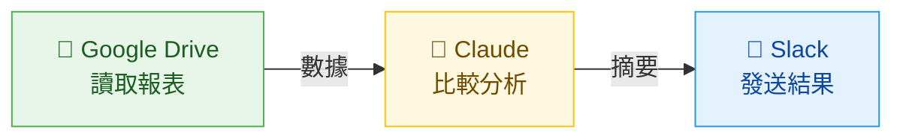
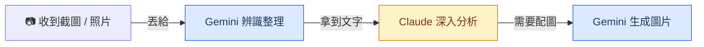

# AI 工具概覽

快速搞懂名詞，建立正確期待

<div class="abs-br m-6 text-sm opacity-50">
KKday 全球策略行銷處工作坊 — 2026/03/25
</div>

<!--
「在我們開始動手之前，先花幾分鐘把一些名詞搞清楚。
這些詞你們可能在新聞或同事聊天中聽過，今天一次幫大家對齊。」
-->

---

# AI 到底是什麼？

<div class="grid grid-cols-2 gap-12 mt-4">
<div>

### 你可以想成...

<div class="text-xl mt-4 leading-relaxed">
一個讀過<span class="text-blue-600 font-bold">整個圖書館所有書</span>的超級助手<br>
你傳紙條問它，它寫紙條回你
</div>

<div class="mt-6 text-sm opacity-70">

- 正式名稱：**LLM**（Large Language Model，大型語言模型）
- 它的原理：像小朋友學說話——聽了超多句子，學會「接下來最可能講什麼」
- 不是搜尋引擎——它是用自己讀過的東西「寫出」答案，不是去 Google「查」答案

</div>

</div>
<div>

### 你不需要知道的

<div class="mt-4 text-base opacity-60">

- 神經網路怎麼運作
- 模型怎麼訓練的
- 參數有幾億個

</div>

<div class="mt-6 p-4 bg-blue-50 rounded-lg text-base">
你只需要知道：<br>
<strong>怎麼問問題，讓它給你有用的答案</strong><br>
就像你不需要知道微波爐怎麼發射電磁波，只要會按按鈕加熱就好
</div>

</div>
</div>

<!--
「AI 這個詞很大，今天我們講的 AI 其實就是大型語言模型，英文叫 LLM。
你可以把它想成一個讀過整個圖書館所有書的超級助手。
就像小朋友學說話，聽了很多句子之後自然學會怎麼接話——AI 也是這樣，
讀了超多文字之後，學會了怎麼回答問題。
但它不是 Google——它是用自己學到的東西寫出答案，不是去查答案。」
-->

---

# 今天會用到的名詞

<div class="grid grid-cols-3 gap-6 mt-6">

<div class="p-5 bg-amber-50 rounded-lg">
<div class="text-lg font-bold mb-2">Prompt（提示詞）</div>
<div class="text-sm">你打給 AI 的<strong>指令或問題</strong></div>
<div class="mt-3 text-sm opacity-70">
像在餐廳點餐——<br>說「牛排七分熟不要蘑菇」比「隨便」好
</div>
</div>

<div class="p-5 bg-green-50 rounded-lg">
<div class="text-lg font-bold mb-2">上下文（Context）</div>
<div class="text-sm">AI 記住的<strong>這次對話內容</strong></div>
<div class="mt-3 text-sm opacity-70">
像跟朋友聊天——<br>你不用每句話都重新自我介紹
</div>
</div>

<div class="p-5 bg-purple-50 rounded-lg">
<div class="text-lg font-bold mb-2">Artifacts <span class="text-xs opacity-50 font-normal">（今天不實作）</span></div>
<div class="text-sm">Claude 的<strong>即時預覽視窗</strong></div>
<div class="mt-3 text-sm opacity-70">
像老師在黑板上畫給你看——<br>做出的東西直接顯示在旁邊
</div>
</div>

</div>

<div class="mt-6 text-center text-sm opacity-50">
Prompt 和上下文等等會實際練習；Artifacts 會解釋但不動手做
</div>

<!--
「今天最常用到三個詞：
- Prompt 就是你打給 AI 的話，中文叫提示詞。說得越清楚，AI 回的越好。
- 上下文就是 AI 會記住這次對話講過什麼，所以你可以一直追問、一直修改。
- Artifacts 是 Claude 的一個功能，做出來的東西會直接預覽在旁邊。今天會帶大家看是什麼，但不會實際操作。」
-->

---

# 你可能會聽到的名詞（1/2）

<div class="mt-2 text-sm opacity-60 mb-6">不需要記住，知道是什麼就好</div>

<div class="grid grid-cols-2 gap-x-12 gap-y-6">

<div class="flex items-start gap-3">
<div class="text-base font-bold text-blue-700 w-36 shrink-0">多模態</div>
<div class="text-sm">AI 不只看得懂文字，還能看懂<strong>圖片、PDF、影片</strong>。<br>Gemini 的圖像辨識就是多模態能力。</div>
</div>

<div class="flex items-start gap-3">
<div class="text-base font-bold text-blue-700 w-36 shrink-0">Token</div>
<div class="text-sm">AI 的「字數券」，大約 <strong>1 個中文字 ≈ 1~2 張券</strong>。<br>就像手機流量——用越多，花越多。</div>
</div>

<div class="flex items-start gap-3">
<div class="text-base font-bold text-blue-700 w-36 shrink-0">Hallucination</div>
<div class="text-sm">AI <strong>一本正經地胡說八道</strong>。<br>就像考試時不會寫但硬掰一個看起來很對的答案。要 double check！</div>
</div>

</div>

<!--
「這幾個詞你不需要記住，但以後看新聞或跟工程師聊天時會比較有感覺。
最重要的是 Hallucination——AI 幻覺，就是 AI 會一本正經地編答案。
這就是為什麼我們一直強調要 double check。」
-->

---

# 你可能會聽到的名詞（2/2）

<div class="mt-2 text-sm opacity-60 mb-6">跟「AI 連接外部工具」相關的名詞</div>

<div class="grid grid-cols-2 gap-x-12 gap-y-6">

<div class="flex items-start gap-3">
<div class="text-base font-bold text-blue-700 w-36 shrink-0">CLI（命令列）</div>
<div class="text-sm">用文字指令操作的介面（黑色畫面）。<br>Claude Code、Gemini CLI 都是 CLI 工具，<strong>適合自動化流程</strong>。</div>
</div>

<div class="flex items-start gap-3">
<div class="text-base font-bold text-blue-700 w-36 shrink-0">MCP</div>
<div class="text-sm">讓 AI 連接外部服務（Slack、Jira 等）的<strong>標準插頭</strong>。<br>像 USB-C 一樣——一條線就能接所有設備。</div>
</div>

<div class="flex items-start gap-3">
<div class="text-base font-bold text-blue-700 w-36 shrink-0">Connectors</div>
<div class="text-sm">Claude 內建的「<strong>一鍵連接</strong>」功能。<br>不需要工程師，在設定頁授權就能連 Slack 等服務。</div>
</div>

</div>

<!--
「這三個是跟 AI 連接外部工具有關的。
MCP 是標準協定，Connectors 是 Claude 內建的一鍵連接功能，
CLI 是工程師用的進階介面。等等介紹 Claude Desktop 時會再看到。」
-->

---

# 公司有哪些 AI 工具？

<div class="grid grid-cols-3 gap-6 mt-4">

<div class="p-4 rounded-lg border border-gray-200">
<div class="text-center text-sm font-bold opacity-60 mb-3">網頁版</div>
<div class="flex justify-center gap-4">
<div class="text-center">
<div class="px-3 py-2 bg-amber-50 rounded font-bold text-sm">claude.ai</div>
</div>
<div class="text-center">
<div class="px-3 py-2 bg-blue-50 rounded font-bold text-sm">gemini.google.com</div>
</div>
</div>
<div class="text-center text-xs mt-2 opacity-60">打開瀏覽器就能用</div>
</div>

<div class="p-4 rounded-lg border-2 border-blue-200 bg-blue-50">
<div class="text-center text-sm font-bold opacity-60 mb-3">桌面 App（今天主要用）</div>
<div class="flex justify-center gap-4">
<div class="text-center">
<div class="px-3 py-2 bg-amber-100 rounded font-bold text-sm">Claude Desktop</div>
</div>
</div>
<div class="text-center text-xs mt-2 opacity-60">安裝在電腦上，支援 Connectors / Cowork</div>
</div>

<div class="p-4 rounded-lg border border-gray-200 opacity-60">
<div class="text-center text-sm font-bold opacity-60 mb-3">CLI（工程師用）</div>
<div class="flex justify-center gap-4">
<div class="text-center">
<div class="px-3 py-2 bg-gray-100 rounded font-bold text-sm">Claude Code</div>
</div>
<div class="text-center">
<div class="px-3 py-2 bg-gray-100 rounded font-bold text-sm">Gemini CLI</div>
</div>
</div>
<div class="text-center text-xs mt-2 opacity-60">Terminal 裡跑，適合自動化流程</div>
</div>

</div>

<div class="mt-6 text-center text-base">
背後的 AI 模型一樣，但介面不同，能做的事也不同——桌面 App 能連工具、CLI 能自動化
</div>

<!--
「Claude 跟 Gemini 各自有不同的使用方式：網頁版、桌面 App、還有工程師用的 CLI。
背後的 AI 模型是同一個，但因為介面不同，能做的事也不一樣。
今天我們主要用 Claude Desktop——桌面 App 多了 Connectors 跟 Cowork，
可以直接連 Slack、Google Calendar，還能交辦任務讓它自己跑。
CLI 則適合做自動化流程。」
-->

---
layout: section
---

# Claude Desktop 介紹

不只是對話框——你的 AI 協作中心

<!--
「接下來花幾分鐘帶大家認識今天的主角——Claude Desktop。
它不只是把網頁版包成一個 App，而是多了很多獨家功能。」
-->

---

# Claude Desktop：三個分頁

<div class="grid grid-cols-2 gap-6">
<div>

</div>
<div class="flex flex-col gap-3 justify-center">

<div class="p-3 bg-amber-50 rounded-lg">
<span class="font-bold">Chat</span> — 一般對話、問答、分析資料
</div>

<div class="p-3 bg-purple-50 rounded-lg">
<span class="font-bold">Cowork</span> — 背景代理人，交辦後自動執行
</div>

<div class="p-3 bg-green-50 rounded-lg">
<span class="font-bold">Code</span> — 開發助手，讀取編輯本地檔案
</div>

</div>
</div>

<!--
「打開 Claude Desktop，最上面有三個分頁：Chat、Cowork、Code。
今天我們主要會用 Chat，但 Cowork 也非常值得認識。」
-->

---

# Chat 分頁：你最熟悉的對話介面

<div class="grid grid-cols-2 gap-6">
<div>

</div>
<div class="text-sm">

**怎麼用**

1. **打字問問題**：下方輸入框直接輸入
2. **上傳檔案**：點 **+** 按鈕，或拖曳檔案進來
3. **選模型**：右下角切換（Opus 4.6 / Sonnet 等）
4. **快捷按鈕**：Code / Write / Create / Learn / From Drive

**跟網頁版的差別**

- 支援 **Connectors**（直接連 Slack、Google Drive 等）
- Mac 雙擊 Option 鍵 → **Quick Entry**（截圖快速提問）

</div>
</div>

<!--
「Chat 分頁長這樣，跟網頁版很像。
下方輸入框打字就能問問題，點加號可以上傳檔案。
桌面版多了 Connectors 跟 Quick Entry——Mac 上雙擊 Option 鍵
可以快速截圖問 AI，等等可以試試看。」
-->

---

# Cowork 分頁：你的背景代理人

<div class="grid grid-cols-2 gap-6">
<div>

</div>
<div class="text-sm">

**Chat vs Cowork**

| | Chat | Cowork |
|---|---|---|
| 像什麼？ | 即時通訊聊天 | **派一個助理去辦事** |
| 要盯著嗎？ | 要 | **不用，去做別的事** |
| 檔案存取 | 手動上傳 | **直接讀整個資料夾** |
| 適合 | 快速問答 | **耗時複雜任務** |

</div>
</div>

<div class="mt-3 p-3 bg-purple-50 rounded-lg text-sm">

**怎麼用**：點「Cowork」→ 選資料夾（Work in a folder）→ 描述任務 → 按「**Let's go**」→ 去喝杯咖啡

</div>

<!--
「Cowork 是 Claude Desktop 最強大的功能。
你交辦一個任務，它會自己翻閱資料夾、規劃步驟、產出檔案。
你不用一直守在螢幕前，做完會通知你。
Chat 是即時對話，Cowork 是委派任務。」
-->

---

# Dispatch：手機交辦，電腦執行

<div class="grid grid-cols-2 gap-6">
<div class="flex justify-center">

</div>
<div class="text-sm">

**手機 = 遙控器，電腦 = 機器人**

在外面用手機下指令，辦公室電腦就自動幫你做事——像遙控掃地機器人一樣。

**設定方式**

1. 更新 Desktop + 手機 App 到最新版
2. Cowork 分頁 → 左側「**Dispatch**」→「**Get started**」
3. 開啟檔案存取 + 保持電腦喚醒
4. 手機 App 傳訊息，電腦就開始執行

<div class="mt-3 p-2 bg-orange-50 rounded text-xs">
注意：電腦需<strong>保持開機且 App 開著</strong><br>
目前僅 Pro / Max 方案可用，<strong>Team 方案尚未開放</strong>
</div>

</div>
</div>

<!--
「Dispatch 是 2026 年 3 月剛推出的新功能。
你在外面開會，用手機跟 Claude 說要做什麼，
辦公室的電腦就會開始處理。唯一限制是電腦要保持開機。」
-->

---

# Scheduled Tasks：讓 Claude 定時幫你做事

<div class="mt-2">

</div>

<div class="grid grid-cols-2 gap-8 mt-4 text-sm">
<div>

**怎麼設定**

- 在 Cowork 輸入 `/schedule`
- 或左側「Scheduled」→「+ New task」

**可選頻率**：每小時 / 每天 / 平日 / 每週 / 手動觸發

</div>
<div>

**行銷應用情境**

- 每天早上 9 點自動整理昨天的行銷數據
- 每週一產出上週各管道 ROAS 報表
- 每天追蹤競品社群動態並摘要
- 定時檢查 coupon 到期日並提醒

</div>
</div>

<div class="mt-3 text-xs opacity-60 text-center">
電腦需保持開機；錯過的排程會在喚醒時自動補跑
</div>

<!--
「排程任務：設好時間跟內容，Claude 定時自動執行。
例如每天早上 9 點自動整理行銷數據，完全不用手動。」
-->

---

# Connectors：一鍵連接你的工作工具

<div class="grid grid-cols-2 gap-6 text-sm">
<div>

**設定步驟**

1. 對話框點 **+** →「**Connectors**」
2. 瀏覽服務，點「**Connect**」
3. 完成 OAuth 授權（一鍵）
4. 所有對話都能用

**支援服務**：Google Drive / Slack / Jira / Google Calendar / Notion / GitHub 等 50+

<span class="text-xs opacity-60">完整清單：claude.ai/connectors</span>

</div>
<div>

<div class="p-3 bg-amber-50 rounded-lg">

**之前**：像傳話遊戲——開 Slack 複製 → 貼到 Claude → 複製結果 → 貼回 Slack

**現在**：像有一個助理直接坐在你旁邊幫你看——「幫我看 Slack #marketing 今天有什麼重點」

</div>

<div class="mt-3 p-3 bg-blue-50 rounded-lg">

**關鍵差異**：不只是「讀」，還能「寫」——Claude 可以幫你**發 Slack 訊息、建 Google Doc、加日曆事件**

</div>

</div>
</div>

<!--
「Connectors 讓 Claude 直接連你的工具，不用複製貼上。
設定很簡單：點加號、選服務、授權，一次設定所有對話都能用。
而且不只是讀取資料，它還可以幫你寫回去——發 Slack 訊息、建文件、加日曆都行。」
-->

---

# Connectors 實際應用情境

<div class="grid grid-cols-2 gap-6 mt-4 text-sm">
<div>

**單一工具**

<div class="mt-2 flex flex-col gap-2">
<div class="p-2 bg-green-50 rounded">
<span class="font-bold text-green-700">Google Drive</span><br>
「幫我看 Drive 裡上週的週報，整理出 3 個重點」
</div>
<div class="p-2 bg-purple-50 rounded">
<span class="font-bold text-purple-700">Slack</span><br>
「#marketing 頻道這週討論了哪些活動？列出待辦事項」
</div>
<div class="p-2 bg-blue-50 rounded">
<span class="font-bold text-blue-700">Google Calendar</span><br>
「我下週行程很滿，幫我找出可以排 1 小時會議的空檔」
</div>
</div>

</div>
<div>

**跨工具串聯** ⭐

<div class="mt-2 flex flex-col gap-2">
<div class="p-2 bg-amber-50 rounded">
<span class="font-bold text-amber-700">Drive → Slack</span><br>
「讀 Drive 裡的週報數據，整理重點摘要，發到 #weekly-report」
</div>
<div class="p-2 bg-amber-50 rounded">
<span class="font-bold text-amber-700">Slack → Google Doc</span><br>
「把 #campaign-brainstorm 這週的討論整理成一份企劃草稿，存到 Drive」
</div>
<div class="p-2 bg-amber-50 rounded">
<span class="font-bold text-amber-700">Jira → Slack</span><br>
「查 Jira 上行銷相關的 ticket 進度，整理成狀態更新發到 #marketing」
</div>
</div>

</div>
</div>

<!--
「Connectors 最強的地方是跨工具串聯。
以前你要自己開 Drive 看報表、複製數字、整理成訊息、再貼到 Slack。
現在一句話就搞定：『讀 Drive 裡的週報，整理重點，發到 Slack 頻道』。
它可以一次串兩三個工具，省掉中間所有複製貼上的步驟。」
-->

---

# Connectors：一句話串聯多個工具

<div class="mt-4">

```
「幫我看 Google Drive 裡這個月的廣告成效報表，
　跟上個月比較，找出表現下降的管道，
　整理成重點摘要，發到 Slack #marketing-weekly」
```

</div>

<div class="mt-4">



</div>

<div class="mt-4 p-3 bg-gray-50 rounded-lg text-sm">

**你不需要**：下載檔案 → 開 Excel → 手動比對 → 寫訊息 → 貼到 Slack<br>
**你只需要**：用一句話描述你要什麼結果

</div>

<!--
「這張投影片是一個完整的例子。
你只要講一句話，Claude 就會自動去 Drive 讀報表、做分析比較、
然後把結果發到 Slack。整個過程你不用切換任何視窗。
這就是 Connectors 最實用的地方——把你每天重複做的跨工具操作，
變成一句話就能完成。」
-->

---
layout: section
---

# AI 能與不能

建立正確期待，讓你更知道怎麼用

<!--
「OK 名詞對齊了，接下來聊聊 AI 的邊界。
剛才大家看到 AI 可以寫網頁、分析資料，看起來很厲害，
但在我們往下走之前，先聊聊它做得到和做不到的事。」
-->

---
layout: two-cols
---

# AI 擅長 <span class="text-green-600">✓</span>

<v-clicks>

- **讀懂資料、做計算、找規律**<br><span class="text-sm opacity-70">→ 剛才的客戶分析</span>
- **寫文字：報告、Email、翻譯**<br><span class="text-sm opacity-70">→ 等等會看到</span>
- **記住這次對話的上下文**<br><span class="text-sm opacity-70">→ 剛才我們連續追問，不用重新描述</span>
- **把重複的邏輯自動化**<br><span class="text-sm opacity-70">→ 等等深入主題會做</span>

</v-clicks>

::right::

# AI 做不到 <span class="text-orange-500">✗</span>

<v-clicks>

- **搜尋結果不保證 100% 正確**<br><span class="text-sm opacity-70">可以上網搜，但還是要自己驗證</span>
- **操作後台系統需要額外設定**<br><span class="text-sm opacity-70">透過 Computer Use、MCP 等工具可以做到，但需要設定和監督</span>
- **數字、日期一定要 double check**<br><span class="text-sm opacity-70">AI 會很有自信地給出錯誤答案（Hallucination！）</span>

</v-clicks>

<!--
用剛才的 demo 舉例帶過每個擅長項目。
做不到的部分重點強調「不保證正確」——呼應前面講的 Hallucination。
-->

---
layout: center
---

# 把 AI 當成一個<br>反應超快、但需要你 double check 的<span class="text-blue-600">實習生</span>

<div class="mt-8 text-xl opacity-70">
你是導演，它是演員——你給劇本，它來演。<br>
但演完之後你要看一下有沒有演錯。
</div>

<!--
一句話總結。
接著轉場：「OK，那我們來選今天要深入做哪兩個主題。」
-->

---
layout: section
---

# Claude vs Gemini 怎麼選？

什麼時候開 Claude，什麼時候開 Gemini

<!--
「今天我們主要用 Claude Desktop，但公司也有 Gemini。
最後幾分鐘幫大家搞清楚：什麼時候開 Claude，什麼時候開 Gemini。」
-->

---

# 依場景選工具

| 我想要... | 用這個 | 一句話原因 |
|---|---|---|
| 分析 CSV / Excel | **Claude** | 上傳 → 問問題 → 拿圖表和結論 |
| 寫報告 / Email / 文案 | **Claude** | 結構化寫作最穩，繁中最自然 |
| 辨識截圖、照片、掃描文件 | **Gemini** | 圖像辨識最準確（多模態最強） |
| 分析 Google Sheets | **Gemini** | 直連 Google Drive，不用下載上傳 |
| 需要生成配圖 | **Gemini** | Imagen 內建，描述就生圖 |

<style>
td:nth-child(2) { font-weight: bold; }
</style>

<!--
逐行帶過，每個都用一句話解釋。
強調不是哪個比較好，而是各有擅長。
「辨識截圖那邊，就是前面講到的多模態能力。」
-->

---
layout: center
---

# 文字分析找 <span class="text-amber-600">Claude</span>，看圖生圖找 <span class="text-blue-600">Gemini</span>

<!--
一句話記住。停 2 秒讓大家記住這句話。
-->

---

# 搭配使用的建議流程



<div class="mt-6 text-center text-lg">
兩個工具各有擅長，搭配著用效果最好
</div>

<!--
「實際工作上，一件事可能兩個都用到。」

1. 收到截圖/照片 → Gemini 辨識整理成文字
2. 拿到文字資料 → Claude 深入分析、產報告
3. 報告需要配圖 → Gemini 生成

舉例：客戶傳了一張手寫訂單照片 → Gemini 辨識 → Claude 做分析報告 → Gemini 生配圖
-->

---

# Prompt 技巧，兩邊都通用

<v-clicks>

- **描述情境與目標** — 像告訴計程車司機目的地：「我要去101，走信義路比較快」比「隨便開」好
- **給範例** — 「格式像這樣：名字 / 國家 / 金額」——給 AI 一個參考答案，它就知道你要什麼
- **指定格式** — 「用表格」「用條列」「用 email 格式」——像點飲料選大杯小杯冰塊甜度
- **追問修改** — 「改成只看台灣客戶」「再精簡一點」——不滿意可以一直改，就像跟設計師來回修稿

</v-clicks>

<div v-click class="mt-4 p-3 bg-amber-50 rounded-lg text-sm">

**常見迷思**：「要先跟 AI 說『你是一個資深分析師』才會回答得好」——現在的 AI 已經很擅長理解意圖，**把你的情境和目標講清楚**比指定角色更有效。你也不需要手動把任務拆成步驟，AI 會自己規劃。

</div>

<div v-click class="mt-3 text-center text-lg font-bold text-blue-700">
帶走的是方法，不是只有一個工具
</div>

<!--
「你們可能在網路上看過『要先指定角色 AI 才會回答得好』——
這在早期的模型確實有效，但現在的 Claude 和 Gemini 已經很聰明了。
與其說『你是資深分析師』，不如把你的情境講清楚：
『我要準備週會報告，對象是行銷主管，需要各管道 ROAS 比較』。
AI 會自動用對的專業程度回答你。同樣地，你也不用手動拆步驟，
把目標講清楚，AI 會自己規劃怎麼做。」
-->

---
layout: section
---

# 動手試試看

打開 Claude Desktop，跟著操作

<!--
「OK 觀念的部分都講完了，接下來我們實際動手操作。
請大家打開 Claude Desktop，跟著我一起做。」
-->

---

# Claude Desktop：快速上手

<div class="grid grid-cols-3 gap-6 mt-2 text-sm">
<div>

**安裝**

1. **claude.ai/download** 下載
2. macOS 11+ / Windows 10+
3. 用公司帳號登入

</div>
<div>

**Chat 操作**

- 輸入框打字發問
- 點 **+** 上傳檔案或加 Connectors
- 拖曳檔案直接上傳
- Mac 雙擊 **Option** → Quick Entry

</div>
<div>

**Cowork 操作**

1. 點「**Cowork**」分頁
2. Settings → 授權資料夾 + 填寫偏好
3. 描述任務 →「**Let's go**」

</div>
</div>

<div class="mt-4 p-3 bg-blue-50 rounded-lg text-sm">

**小技巧**：輸入 `/` 可看所有斜線指令（`/schedule` 建排程、`/search` 搜尋等）；右下角可切換 AI 模型

</div>

<!--
「下載安裝到 claude.ai/download，登入就好。
Chat 操作跟網頁版一樣。Cowork 第一次用先到設定授權資料夾。
輸入斜線可以看到所有快捷指令。」
-->

---
layout: center
---

# 帶走一個行動

<div class="text-2xl mt-6 leading-relaxed">
回去找一件<span class="text-blue-600 font-bold">你這週要做的事</span><br>
先用 Claude Desktop 試試看
</div>

<div class="mt-8 text-lg opacity-70">
卡住了就截圖丟 <a href="https://kkday.slack.com/archives/C08M4EC9XC2">#kkday-ai-titan</a> 問 Rex（@rd_web_rex）或 Jeff（@rd_b2cpd_jeff）
</div>

<!--
「回去之後，找一件你這週要做的事，先用 Claude Desktop 試試看。
卡住了就截圖丟 Slack 問我們。」
-->

---
layout: center
class: text-center
---

# 謝謝！

<div class="mt-4 text-lg opacity-70">
有問題隨時丟 Slack 問 Rex（@rd_web_rex）或 Jeff（@rd_b2cpd_jeff）
</div>

<div class="mt-6 text-base">

**Slack 頻道** — [#kkday-ai-titan](https://kkday.slack.com/archives/C08M4EC9XC2)

</div>

<div class="mt-4 p-4 bg-blue-50 rounded-lg inline-block text-left text-sm">

**課後回饋問卷** （幫我們變得更好！）

- EN: [AI Tools Workshop - Post-Session Feedback Survey](https://forms.gle/vvoqFZfVFU1MSZub6)
- ZH: [AI 工具 Workshop 課後回饋問卷](https://docs.google.com/forms/d/1aFZaHL879F2RlhcPnSJHhIyoJ4FR6S42UzlbhyAZpTE/edit)

</div>

<!--
交給 Ming & Mike 總結，或進入自由 Q&A 時間。
提醒大家填問卷、加入 Slack 頻道。
-->
