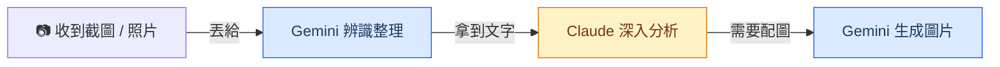

# AI 能與不能

建立正確期待，讓你更知道怎麼用

KKday 全球策略行銷處工作坊 — 2026/03/25

<!--
「剛才大家看到 AI 可以寫網頁、分析資料，看起來很厲害。
但在我們往下走之前，先花一分鐘聊聊它的邊界，這樣等等實作時你們會更知道怎麼用。」
-->

---
layout: two-cols
---

# AI 擅長 ✓

<v-clicks>

- **讀懂資料、做計算、找規律** → 剛才的客戶分析
- **寫文字：報告、Email、翻譯** → 等等會看到
- **記住這次對話的上下文** → 剛才我們連續追問，不用重新描述
- **把重複的邏輯自動化** → 等等深入主題會做

</v-clicks>

::right::

# AI 做不到 ✗

<v-clicks>

- **搜尋結果不保證 100% 正確** 可以上網搜，但還是要自己驗證
- **不會登入後台系統操作** 今天做到「整理好設定」，自動化是下一步
- **數字、日期一定要 double check** AI 會很有自信地給出錯誤答案

</v-clicks>

<!--
用剛才的 demo 舉例帶過每個擅長項目。
做不到的部分重點強調「不保證正確」——這是最常踩的坑。
-->

---
layout: center
---

# 把 AI 當成一個 反應超快、但需要你 double check 的實習生

你給方向，它幫你跑腿。

<!--
一句話總結。
接著轉場：「OK，那我們來選今天要深入做哪兩個主題。」
-->

---
layout: section
---

# Claude vs Gemini 怎麼選？

什麼時候開 Claude，什麼時候開 Gemini

<!--
「今天我們主要用 claude.ai，但公司也有 Gemini。
最後幾分鐘幫大家搞清楚：什麼時候開 Claude，什麼時候開 Gemini。」
-->

---

# 依場景選工具

| 我想要... | 用這個 | 一句話原因 |
|---|---|---|
| 分析 CSV / Excel | **Claude** | 上傳 → 問問題 → 拿圖表和結論 |
| 寫報告 / Email / 文案 | **Claude** | 結構化寫作最穩，繁中最自然 |
| 辨識截圖、照片、掃描文件 | **Gemini** | 圖像辨識最準確 |
| 分析 Google Sheets | **Gemini** | 直連 Google Drive，不用下載上傳 |
| 需要生成配圖 | **Gemini** | Imagen 內建，描述就生圖 |

<!--
逐行帶過，每個都用一句話解釋。
強調不是哪個比較好，而是各有擅長。
-->

---
layout: center
---

# 文字分析找 Claude，看圖生圖找 Gemini

<!--
一句話記住。停 2 秒讓大家記住這句話。
-->

---

# 搭配使用的建議流程

兩個工具各有擅長，搭配著用效果最好

<!--
「實際工作上，一件事可能兩個都用到。」

1. 收到截圖/照片 → Gemini 辨識整理成文字
2. 拿到文字資料 → Claude 深入分析、產報告
3. 報告需要配圖 → Gemini 生成

舉例：客戶傳了一張手寫訂單照片 → Gemini 辨識 → Claude 做分析報告 → Gemini 生配圖
-->

---

# 今天學的 Prompt 技巧，兩邊都通用

<v-clicks>

- **指定角色** — 「你是一個資深行銷分析師...」
- **分步驟** — 「第一步...第二步...第三步...」
- **給範例** — 「格式像這樣：名字 / 國家 / 金額」
- **指定格式** — 「用表格」「用條列」「用 email 格式」
- **追問修改** — 「改成只看台灣客戶」「再精簡一點」

</v-clicks>

帶走的是方法，不是只有一個工具

<!--
「今天學的 prompt 技巧——指定角色、分步驟、給範例——在 Claude 和 Gemini 上都通用。
帶走的是方法，不是只有一個工具。」
-->

---

# 延伸：連接其他工具

### 簡單版：Claude Connectors

- 設定頁一鍵授權
- 支援 Slack、Google Calendar、Jira 等
- 免裝任何東西

### 進階版：找工程師

- Claude Code / Gemini CLI + MCP
- 彈性最大、可客製化
- 有自動化需求 → 開 JIRA ticket

設定有問題？直接問 AI「怎麼設定 Claude Connector 連 Slack」，它會一步步教你

<!--
這頁快速帶過就好，除非有人主動問。
重點是讓大家知道「有這個東西存在」，不需要深入。
-->

---
layout: center
---

# 帶走一個行動

回去找一件你這週要做的事 
先用 claude.ai 試試看

卡住了就截圖丟 Slack 問 Rex 或 Jeff 
下週我們做個 15 分鐘 follow-up，聽聽大家的實戰經驗

<!--
「回去之後，找一件你這週要做的事，先用 claude.ai 試試看。
卡住了就截圖丟 Slack 問我們。下週我們做個 15 分鐘 follow-up，聽聽大家的實戰經驗。」
-->

---
layout: center
class: text-center
---

# 謝謝！

Slack 找 Rex 或 Jeff

有確定要做的自動化需求 → 開 JIRA ticket

<!--
交給 Ming & Mike 總結，或進入自由 Q&A 時間。
-->
