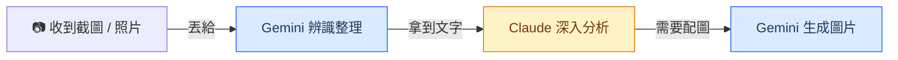

# AI 工具概覽

快速搞懂名詞，建立正確期待

KKday 全球策略行銷處工作坊 — 2026/03/25

<!--
「在我們開始動手之前，先花幾分鐘把一些名詞搞清楚。
這些詞你們可能在新聞或同事聊天中聽過，今天一次幫大家對齊。」
-->

---

# AI 到底是什麼？

### 你可以想成...

一個讀過整個網路的文字助手 
你打字問它，它打字回你

- 正式名稱：**LLM**（Large Language Model，大型語言模型）
- 它的原理：看過海量文字，學會「接下來最可能的回答」
- 不是搜尋引擎——它是在「生成」答案，不是在「查」答案

### 你不需要知道的

- 神經網路怎麼運作
- 模型怎麼訓練的
- 參數有幾億個

你只需要知道： 
<strong>怎麼問問題，讓它給你有用的答案</strong>

<!--
「AI 這個詞很大，今天我們講的 AI 其實就是大型語言模型，英文叫 LLM。
你可以把它想成一個讀過整個網路的文字助手，你用文字跟它互動。
它的強項是語言理解和生成，不是什麼都會。」
-->

---

# 今天會用到的名詞

Prompt（提示詞）

你打給 AI 的<strong>指令或問題</strong>

就像跟同事交辦工作—— 說得越清楚，結果越好

上下文（Context）

AI 記住的<strong>這次對話內容</strong>

你不用每次重新描述—— 它記得你前面說了什麼

Artifacts

Claude 的<strong>即時預覽視窗</strong>

做出的網頁、圖表會直接 顯示在右邊讓你互動

等等 Demo 時會實際看到這些東西

<!--
「今天最常用到三個詞：
- Prompt 就是你打給 AI 的話，中文叫提示詞。說得越清楚，AI 回的越好。
- 上下文就是 AI 會記住這次對話講過什麼，所以你可以一直追問、一直修改。
- Artifacts 是 Claude 的一個功能，做出來的東西會直接預覽在旁邊，等等 Demo 就會看到。」
-->

---

# 你可能會聽到的名詞

不需要記住，知道是什麼就好

多模態

AI 不只看得懂文字，還能看懂<strong>圖片、PDF、影片</strong>。 Gemini 的圖像辨識就是多模態能力。

Token

AI 讀寫的計量單位，大約 <strong>1 個中文字 ≈ 1~2 個 token</strong>。 輸入和輸出越多，消耗越多 token。

CLI（命令列）

用文字指令操作的介面（黑色畫面）。 Claude Code、Gemini CLI 都是 CLI 工具，<strong>適合自動化流程</strong>。

MCP

讓 AI 連接外部服務（Slack、Jira 等）的<strong>標準協定</strong>。 像 USB 一樣，統一了 AI 跟各種工具的接法。

Connectors

Claude 內建的「<strong>一鍵連接</strong>」功能。 不需要工程師，在設定頁授權就能連 Slack 等服務。

Hallucination

AI <strong>一本正經地胡說八道</strong>。 看起來很有自信，但答案是編的。所以要 double check。

<!--
「這頁的名詞你不需要記住，但以後看新聞或跟工程師聊天時會比較有感覺。
最重要的是最後一個 Hallucination——AI 幻覺，就是 AI 會一本正經地編答案。
這就是為什麼我們一直強調要 double check。」
-->

---

# 公司有哪些 AI 工具？

網頁版

claude.ai

gemini.google.com

打開瀏覽器就能用

桌面 App（今天主要用）

Claude Desktop

Gemini App

安裝在電腦上，支援 Connectors

CLI（工程師用）

Claude Code

Gemini CLI

Terminal 裡跑，適合自動化流程

同一個 AI，不同的使用方式——就像 Google 有網頁版也有 App

<!--
「Claude 跟 Gemini 各自有三種使用方式：網頁版、桌面 App、還有工程師用的 CLI。
今天我們主要用 Claude Desktop——就是裝在電腦上的桌面 App，功能跟網頁版一樣，
但多了 Connectors 可以直接連 Slack、Google Calendar 等服務。
CLI 是用文字指令操作的進階介面，適合做自動化。有興趣的話之後可以試試看。」
-->

---
layout: section
---

# Claude Desktop 介紹

不只是對話框——你的 AI 協作中心

<!--
「接下來花幾分鐘帶大家認識今天的主角——Claude Desktop。
它不只是把網頁版包成一個 App，而是多了很多獨家功能。」
-->

---

# Claude Desktop：三個分頁

Chat

一般對話、問答、分析資料

Cowork

背景代理人，交辦後自動執行

Code

開發助手，讀取編輯本地檔案

<!--
「打開 Claude Desktop，最上面有三個分頁：Chat、Cowork、Code。
今天我們主要會用 Chat，但 Cowork 也非常值得認識。」
-->

---

# Chat 分頁：你最熟悉的對話介面

### 怎麼用

1. **打字問問題**：下方輸入框直接輸入
2. **上傳檔案**：點 **+** 按鈕，或直接拖曳檔案進來
3. **選模型**：右下角可切換（Opus 4.6 / Sonnet 等）
4. **快捷功能**：下方有 Code / Write / Create / Learn 等快捷按鈕

### 跟網頁版的差別

- 可以用 **Connectors** 直接連 Slack、Google Drive 等
- Mac 上雙擊 Option 鍵可開啟 **Quick Entry**（快速擷取螢幕畫面問 AI）

<!--
「Chat 分頁長這樣，跟網頁版很像。
下方輸入框打字就能問問題，點加號可以上傳檔案。
桌面版多了 Connectors 跟 Quick Entry——Mac 上雙擊 Option 鍵
可以快速截圖問 AI，等等可以試試看。」
-->

---

# Cowork 分頁：你的背景代理人

### 跟 Chat 的差別

| | Chat | Cowork |
|---|---|---|
| 你要一直盯著嗎？ | 要 | **不用，交辦後去做別的事** |
| 能存取電腦檔案嗎？ | 手動上傳 | **直接讀取整個資料夾** |
| 適合什麼任務？ | 快速問答 | **耗時的複雜任務** |
| 執行方式 | 即時對話 | **在背景的虛擬機器中自動執行** |

### 怎麼用

1. 點「**Cowork**」分頁
2. 選擇要存取的資料夾（Work in a folder）
3. 描述你要完成的任務
4. 按「**Let's go**」→ 去喝杯咖啡，完成會通知你

<!--
「Cowork 是 Claude Desktop 最強大的功能。
你交辦一個任務，例如『幫我把這五份報表合併，產出 Q1 摘要』，
它會自己翻閱你指定的資料夾、規劃步驟、產出檔案。
你不需要一直守在螢幕前——它會在背景的虛擬機器裡自動執行，做完通知你。

跟 Chat 最大的差別：Chat 是即時對話，Cowork 是交辦任務後讓它自己跑。」
-->

---

# Dispatch：手機交辦，電腦執行

### 這是什麼？

用手機上的 Claude App 遠端交辦任務，讓辦公室電腦的 Claude Desktop 執行。

**手機 = 對講機，電腦 = 執行者**

### 設定方式

1. 更新 Claude Desktop + 手機 App 到最新版
2. 打開 Cowork 分頁
3. 左側點「**Dispatch**」→「**Get started**」
4. 開啟檔案存取權限 + 保持電腦喚醒
5. 用手機 App 傳訊息給 Claude，任務就會在電腦上執行

### 注意

電腦必須**保持開機且 App 開著**，Claude 才能執行任務

<!--
「Dispatch 是 2026 年 3 月才剛推出的新功能。
想像你在外面開會，突然想到要整理一份報表——
你用手機打開 Claude App，跟它說要做什麼，
辦公室的電腦就會開始幫你處理，你回來就看到成果了。

設定很簡單，就是在 Cowork 裡面開啟 Dispatch，
然後手機 App 跟電腦會自動配對。
唯一的限制是電腦要保持開機狀態。」
-->

---

# Scheduled Tasks：讓 Claude 定時幫你做事

### 怎麼設定

- **方法 1**：在 Cowork 裡輸入 `/schedule`
- **方法 2**：左側點「Scheduled」→「+ New task」

### 可選頻率

每小時 / 每天 / 平日 / 每週 / 手動觸發

### 行銷應用情境

- 每天早上 9 點自動整理昨天的行銷數據
- 每週一產出上週各管道 ROAS 報表
- 每天追蹤競品社群動態並摘要
- 定時檢查 coupon 到期日並提醒

電腦需保持開機狀態；錯過的排程會在電腦喚醒時自動補跑

<!--
「Scheduled Tasks 就是排程任務。你設好時間跟任務內容，Claude 就會定時自動執行。
設定方式有兩種：在 Cowork 輸入斜線指令 /schedule，或從左邊選 Scheduled 新增。

舉例：你可以設定每天早上 9 點自動整理昨天的行銷數據，
每週一自動跑一份各管道的 ROAS 報表——完全不用手動操作。」
-->

---

# Connectors：一鍵連接你的工作工具

### 設定步驟

1. 對話框點 **+** → 滑到「**Connectors**」 或到 Settings → Customize → Connectors
2. 瀏覽可用服務，點「**Connect**」
3. 完成 OAuth 授權（一鍵）
4. 連接完成，所有對話都能用

### 目前支援的服務

Google Drive / Slack / Linear / Jira / Google Calendar / Asana / Notion / GitHub 等 50+ 服務

完整清單：claude.ai/connectors

### 這代表什麼？

**之前**：打開 Slack 複製訊息 → 貼到 Claude → 拿到結果 → 複製回 Slack

**現在**：直接跟 Claude 說「幫我看今天 Slack #marketing 頻道有什麼重點」

### 行銷應用情境

- 「幫我看 Google Drive 裡的報表，跟上週比有什麼變化」
- 「把這份分析結果發到 Slack #weekly-report」
- 「看看 Jira 上這週有哪些行銷相關的 ticket」

<!--
「Connectors 是 Desktop 最實用的功能之一。
以前你要在不同工具之間複製貼上，現在 Claude 自己去拿資料。

設定超簡單：對話框點加號，選 Connectors，找到你要連的服務，
點 Connect 然後授權就好了。一次設定，所有對話都能用。

舉例：你可以直接跟 Claude 說『幫我看 Google Drive 裡那份報表跟上週比有什麼變化』，
它會自己去 Drive 拿檔案、分析、然後回報給你。」
-->

---

# Claude Desktop：快速上手

### 安裝

1. 到 **claude.ai/download** 下載
2. macOS 11+ 或 Windows 10+ 都支援
3. 安裝後用公司帳號登入

### Chat 基本操作

- 下方輸入框打字發問
- 點 **+** 上傳檔案或連接 Connectors
- 拖曳檔案到視窗直接上傳
- Mac：雙擊 **Option** 鍵 → Quick Entry （截圖 + 快速提問）

### Cowork 基本操作

1. 點上方「**Cowork**」分頁
2. 到 Settings → Cowork 設定：
   - 授權可存取的資料夾
   - 填寫 Global Instructions（讓 Claude 知道你的偏好）
3. 描述任務 → 「**Let's go**」
4. Claude 在背景自動執行，完成會通知

### 小技巧

- 輸入 `/` 可看所有斜線指令
- `/schedule` 建立排程任務
- 右下角可切換不同 AI 模型

<!--
「最後快速帶一下怎麼上手：
下載安裝很簡單，到 claude.ai/download 下載，用公司帳號登入就好。

Chat 的操作跟網頁版幾乎一樣——打字、上傳檔案、拖曳。
Mac 用戶特別推薦 Quick Entry：雙擊 Option 鍵可以直接截圖問 AI。

Cowork 的話，第一次用建議先到設定頁授權資料夾存取，
然後可以填寫 Global Instructions——就是告訴 Claude 你的角色、偏好、常用格式，
之後每次 Cowork 任務都會自動套用。」
-->

---
layout: section
---

# AI 能與不能

建立正確期待，讓你更知道怎麼用

<!--
「OK 名詞對齊了，接下來聊聊 AI 的邊界。
剛才大家看到 AI 可以寫網頁、分析資料，看起來很厲害，
但在我們往下走之前，先聊聊它做得到和做不到的事。」
-->

---
layout: two-cols
---

# AI 擅長 ✓

<v-clicks>

- **讀懂資料、做計算、找規律** → 剛才的客戶分析
- **寫文字：報告、Email、翻譯** → 等等會看到
- **記住這次對話的上下文** → 剛才我們連續追問，不用重新描述
- **把重複的邏輯自動化** → 等等深入主題會做

</v-clicks>

::right::

# AI 做不到 ✗

<v-clicks>

- **搜尋結果不保證 100% 正確** 可以上網搜，但還是要自己驗證
- **不會登入後台系統操作** 今天做到「整理好設定」，自動化是下一步
- **數字、日期一定要 double check** AI 會很有自信地給出錯誤答案（Hallucination！）

</v-clicks>

<!--
用剛才的 demo 舉例帶過每個擅長項目。
做不到的部分重點強調「不保證正確」——呼應前面講的 Hallucination。
-->

---
layout: center
---

# 把 AI 當成一個 反應超快、但需要你 double check 的實習生

你給方向，它幫你跑腿。

<!--
一句話總結。
接著轉場：「OK，那我們來選今天要深入做哪兩個主題。」
-->

---
layout: section
---

# Claude vs Gemini 怎麼選？

什麼時候開 Claude，什麼時候開 Gemini

<!--
「今天我們主要用 Claude Desktop，但公司也有 Gemini。
最後幾分鐘幫大家搞清楚：什麼時候開 Claude，什麼時候開 Gemini。」
-->

---

# 依場景選工具

| 我想要... | 用這個 | 一句話原因 |
|---|---|---|
| 分析 CSV / Excel | **Claude** | 上傳 → 問問題 → 拿圖表和結論 |
| 寫報告 / Email / 文案 | **Claude** | 結構化寫作最穩，繁中最自然 |
| 辨識截圖、照片、掃描文件 | **Gemini** | 圖像辨識最準確（多模態最強） |
| 分析 Google Sheets | **Gemini** | 直連 Google Drive，不用下載上傳 |
| 需要生成配圖 | **Gemini** | Imagen 內建，描述就生圖 |

<!--
逐行帶過，每個都用一句話解釋。
強調不是哪個比較好，而是各有擅長。
「辨識截圖那邊，就是前面講到的多模態能力。」
-->

---
layout: center
---

# 文字分析找 Claude，看圖生圖找 Gemini

<!--
一句話記住。停 2 秒讓大家記住這句話。
-->

---

# 搭配使用的建議流程

兩個工具各有擅長，搭配著用效果最好

<!--
「實際工作上，一件事可能兩個都用到。」

1. 收到截圖/照片 → Gemini 辨識整理成文字
2. 拿到文字資料 → Claude 深入分析、產報告
3. 報告需要配圖 → Gemini 生成

舉例：客戶傳了一張手寫訂單照片 → Gemini 辨識 → Claude 做分析報告 → Gemini 生配圖
-->

---

# 今天學的 Prompt 技巧，兩邊都通用

<v-clicks>

- **指定角色** — 「你是一個資深行銷分析師...」
- **分步驟** — 「第一步...第二步...第三步...」
- **給範例** — 「格式像這樣：名字 / 國家 / 金額」
- **指定格式** — 「用表格」「用條列」「用 email 格式」
- **追問修改** — 「改成只看台灣客戶」「再精簡一點」

</v-clicks>

帶走的是方法，不是只有一個工具

<!--
「今天學的 prompt 技巧——指定角色、分步驟、給範例——在 Claude 和 Gemini 上都通用。
帶走的是方法，不是只有一個工具。」
-->

---

# 延伸：連接其他工具

### 簡單版：Claude Connectors

- 設定頁一鍵授權
- 支援 Slack、Google Calendar、Jira 等
- 免裝任何東西

### 進階版：找工程師

- Claude Code / Gemini CLI + MCP
- 彈性最大、可客製化
- 有自動化需求 → 開 JIRA ticket

設定有問題？直接問 AI「怎麼設定 Claude Connector 連 Slack」，它會一步步教你

<!--
「還記得前面講的 MCP 嗎？就是讓 AI 連外部工具的標準接法。
簡單版用 Connectors 一鍵授權就好，進階版才需要找工程師。」
-->

---
layout: center
---

# 帶走一個行動

回去找一件你這週要做的事 
先用 Claude Desktop 試試看

卡住了就截圖丟 Slack 問 Rex 或 Jeff 
下週我們做個 15 分鐘 follow-up，聽聽大家的實戰經驗

<!--
「回去之後，找一件你這週要做的事，先用 Claude Desktop 試試看。
卡住了就截圖丟 Slack 問我們。下週我們做個 15 分鐘 follow-up，聽聯大家的實戰經驗。」
-->

---
layout: center
class: text-center
---

# 謝謝！

Slack 找 Rex 或 Jeff

有確定要做的自動化需求 → 開 JIRA ticket

<!--
交給 Ming & Mike 總結，或進入自由 Q&A 時間。
-->
